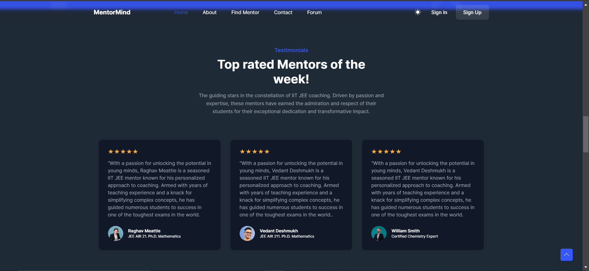

# MentorMind Readme File

MentorMind is a cutting-edge, AI-powered mentorship platform that connects users with mentors in their field of interest. This project utilizes a variety of technologies and tools to provide a seamless, efficient, and secure experience.

## Key Features

### Database

MentorMind is built with [PostgreSQL](https://www.postgresql.org/), a powerful and open-source relational database system. PostgreSQL ensures data integrity and reliability, providing a robust foundation for the application.

### Authentication

NextAuth is used for authentication, offering secure login and user management. This adaptable solution ensures a seamless and secure experience for users.

### Hosting and UI

MentorMind is hosted on [Vercel](https://vercel.com/), a cloud platform for static sites and Serverless Functions. The user interface is delivered using [shadcdn](https://ui.shadcn.com/), ensuring fast and reliable content delivery.

### AI Integration

MentorMind integrates the [OpenAI generative model](https://openai.com/api/) for intelligent and contextually-aware interactions. This AI-powered feature enhances the user experience by providing personalized recommendations and insights.

### Search API

Tavily AI's search API is employed to enable efficient and accurate searching resources across the web. This powerful tool helps users quickly find the information and guidance they need.

### Recommender System

MentorMind's recommender system is built using cosine similarity, PCA, and ANN. This advanced approach ensures that users receive personalized and relevant recommendations based on their schedules and goals.

## Getting Started

To get started with MentorMind, follow these steps:

1. **Setup**: Clone the repository and install the necessary dependencies using the package manager of your choice.
2. **Configuration**: Configure the database connection, authentication, and API keys in the appropriate configuration files.
3. **Install the dependencies** for the Next.js app by running `npm install` in the terminal.
4. **Install the dependencies** for the Flask server by running `pip install -r requirements.txt` in the terminal.
5. **Start the Flask server** by moving to recommender file and running `python app.py` in the terminal.4
6. **Start the Next.js app** by running `npm run dev` in the terminal.

Recommendation System Output:

MentorMind is released under the MIT License. See the [LICENSE](LICENSE) file for more information.
ahdjkakd
